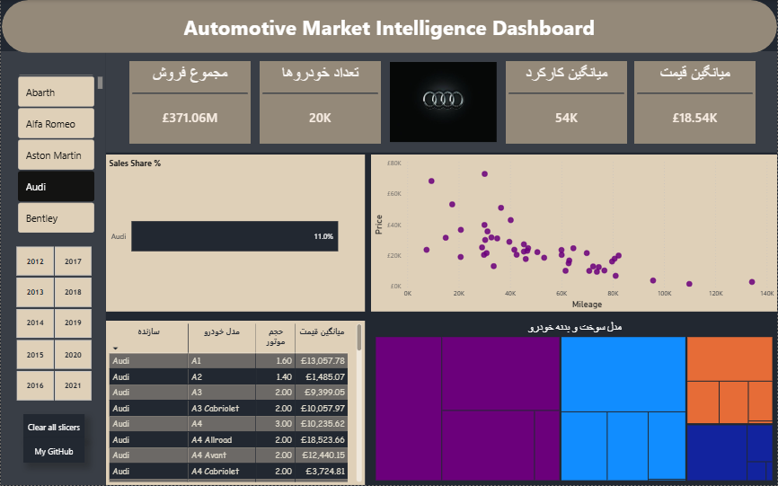
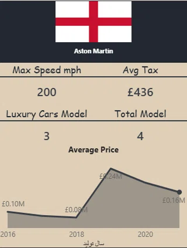
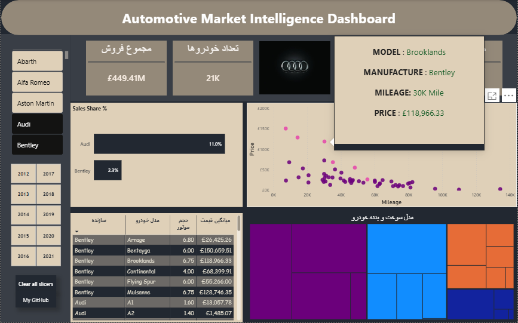
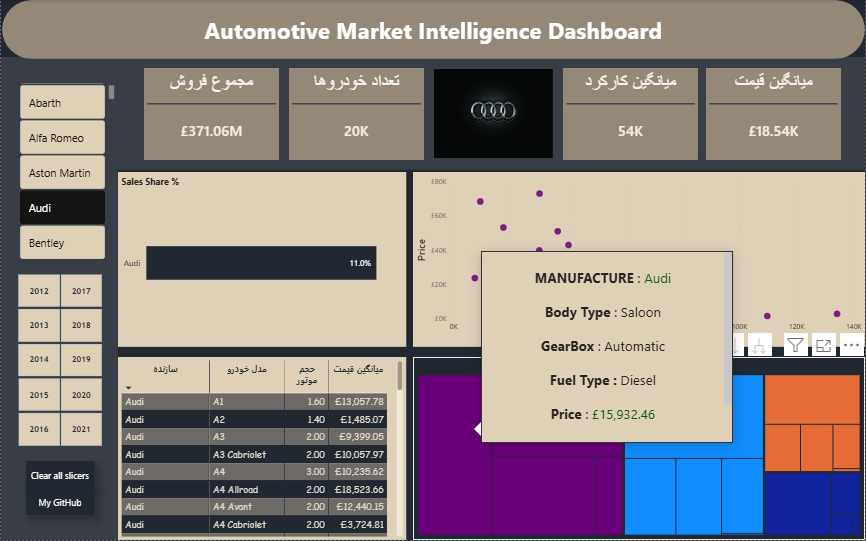
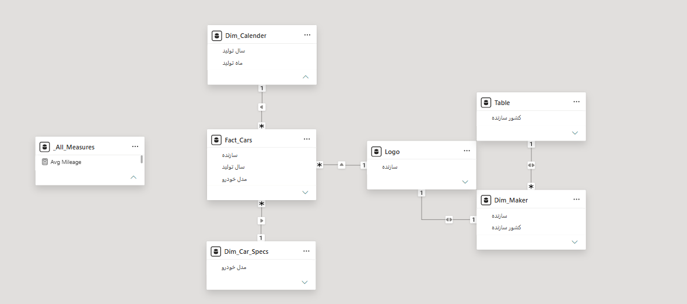

# 🚗 Automotive Market Intelligence & Positioning BI Dashboard

## 📊 Dashboard Preview

### Main Executive Interface

*Figure 1: Corporate executive layout featuring KPIs, market allocation grids, and structured dimensional reporting.*

### Tooltips
| 📈 Market Churn & Trend Analysis | 🎯 (Scatter) | 📐 Specifications Drill-Down (TreeMap) |
| :---: | :---: | :---: |
|  |  |  |
| *Dynamic price trends* | *Granular model metrics context on hover.* | *Structural vehicle dimension summaries.* |

---

## 📌 Project Overview
This production-grade Business Intelligence solution addresses a core automotive commercial challenge: **optimizing inventory pricing strategies and analyzing manufacturer market positioning.** 

By converting a raw, flat dataset of over 1.5 million vehicle records into a highly performant data model, this dashboard provides strategic executives with immediate visibility into pricing degradation, technological market capture (such as fuel type and gearbox trends), and competitive brand clustering.

---

## 🏗️ Data Architecture & Modeling (Star Schema)
To ensure sub-second visual rendering and corporate scalability, the unstructured staging data was normalized into a rigorous **Star Schema** within Power BI:

*   **Fact Table:** `Fact_Cars` – The transactional core capturing specific vehicle pricing (`مبلغ`), road tax allocations, registered years, and active mileage metrics.
*   **Dimension Tables:**
    *   `Dim_Maker`: Normalized mapping for manufacturers, corporate branding, and countries of origin.
    *   `Dim_Car_Specs`: Technical dimension granularity (Model, Body Type, Engine Capacity, Gearbox, and Fuel Type).
    *   `Dim_Calendar`: Dedicated temporal dimension for manufacturing and distribution years.

> **ETL Engineering (Power Query):** Handled heavy data transformation by stripping measurement units (e.g., `mph`, `mpg`, `L`) to enforce pure numerical typing, filtered out records missing foundational keys (e.g., structural door/seat specifications), and preserved critical logical nulls to protect the integrity of descriptive technical averages.



---

## 🧮 Advanced DAX Calculations & Business Metrics
A centralized, isolated measure table `_All_Measures` was constructed to manage the business logic dynamically across various matrix and scatter contexts:

*   **Market Share Penetration (`Sales Share %`):** Uses context-insensitive denominators to evaluate a specific brand's financial capture against global market volume.
```dax
    Sales Share % = 
    DIVIDE(
        [Total Sales],
        CALCULATE([Total Sales], ALL(Dim_Maker))
    )
```
*   **Time-Series Trend Adjustments:** Custom context-overrides engineered into the advanced tooltips to ensure that hovering over a singular data point does not truncate historical trend charts, maintaining a complete time-series perspective for decision makers.

---

## 🎨 UI/UX Design & Data Storytelling Principles
The visual presentation rejects arbitrary visualization placement in favor of structured, sequential user journeys:
1.  **Executive Overview:** Top-tier KPI blocks instantly surface overall sales health (`مجموع فروش`), unit inventory volumes (`تعداد خودروها`), and key operational baselines for pricing and car wear.
2.  **Contextual Branding:** Implemented dynamic corporate iconography layers that shift natively to match slicer contexts (e.g., automatically populating Audi or Bentley brand assets).
3.  **Market Positioning Grid (Scatter Visual):** Correlates `Average Price` against `Mileage` to immediately separate premium low-mileage luxury outliers from rapidly depreciating asset models.
4.  **Custom Report Tooltips:** Engineered semantic text-boxes and custom micro-canvas overlays to dynamically expose complex dimensional features (such as fuel matrices or local country tax standards) without cluttering the master interface.
